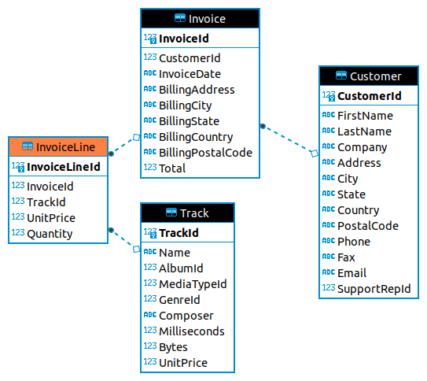

## Database 03
Database is stored in **chinook.sqlite** file

## question 01
Output all tracks with its Genres, ordered by Name of Track
|TrackId|Name|UnitPrice|Name|
|-------|----|---------|----|
|3027|"40"|0.99|Rock|
|2918|"?"|1.99|TV Shows|
|3412|"Eine Kleine Nachtmusik" Serenade In G, K. 525: I. Allegro|0.99|Classical|
|109|#1 Zero|0.99|Alternative & Punk|
|3254|#9 Dream|0.99|Pop|
|...|...|...|...|

Count all tracks from each Genre, and output only Genres more that has at least 100 tracks:

|Name|c|
|----|-|
|Rock|1297|
|Latin|579|
|Metal|374|
|Alternative & Punk|332|
|Jazz|130|

---

## Question 02

Output customers (table *Customer*) and its state (table *State*) name (full name if accessible), if it is not accessible write null, and order it by Last Name.

|FirstName|LastName|StateName|StateAbbr|
|---------|--------|---------|---------|
|Roberto|Almeida|NULL|NULL|
|Julia|Barnett|UTAH|UT|
|Camille|Bernard|NULL|NULL|
|Michelle|Brooks|NEW YORK|NY|
|Robert|Brown|NULL|NULL|
|Kathy|Chase|NEVADA|NV|
|Richard|Cunningham|TEXAS|TX|

---

## Question 03
We have 4 tables: **Invoice**, **InvoiceLine**, **Customer**, **Track**. 

Output Customer name and surname and bought track's name:

|Customer Name|Name|
|-------------|----|
|Leonie Köhler|Balls to the Wall|
|Leonie Köhler|Restless and Wild|
|Bjørn Hansen|Put The Finger On You|
|Bjørn Hansen|Inject The Venom|
|Bjørn Hansen|Evil Walks|
|Bjørn Hansen|Breaking The Rules|
|Daan Peeters|Dog Eat Dog|
|...|...|

---

## Extra assignment
Update CrossProduct.java so that it without using database, only programming code solve the problems from question01, reading data from data/Genre.csv and data/Track.csv